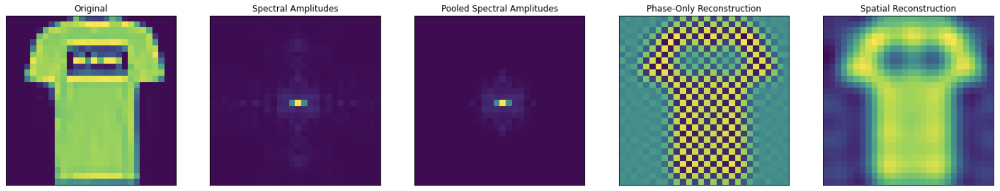
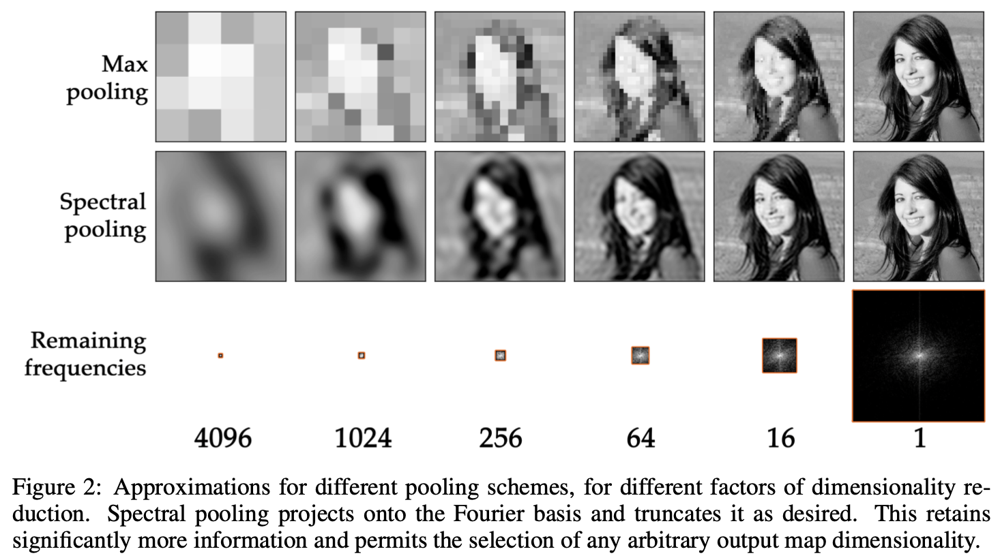
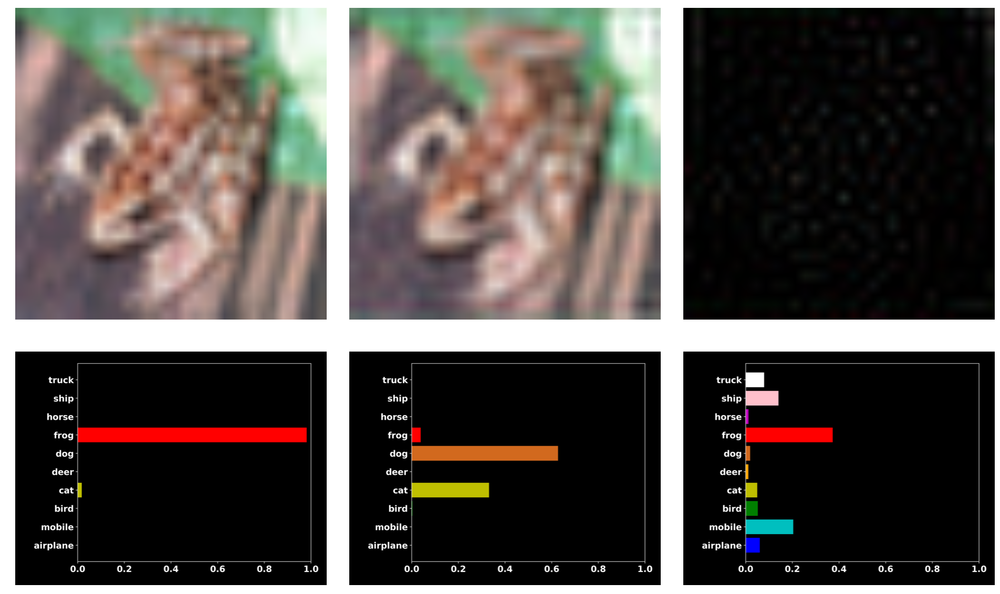

# Spectral Representations for Convolutional Neural Networks
This is my Tensorflow implementation of https://arxiv.org/abs/1506.03767.

### Fine-Grained Tuning
There are 2 issues I seek to highlight in the current invariancy scheme found in convolutional networks.

The paper which I implement explains the first such issue. Max pooling as an op. is too course an operation for dimensionality reduction and invariancy. Specifically, the range of potential 2D max pooling operations is very sparse, meaning that one can only learn so many max poolings when in actually some inbetween value is more suitable for the application at hand. Spectral pooling side-steps that issue due to allowing for a much more finely-grained pooling op. without sacrificing on many of the pros of conventional pooling. These layers are globally and locally high-frequency (or arbitrarily defined) invariant.

### Defence Against Adversarial Attack
Beyond fine-grained control, the ability to prune-out high-frequencies is beneficial for matching neural net thinking to that of human perception as discussed in: https://arxiv.org/abs/1905.13545. Specifically, this second paper finds that neural networks occasionally learn only the high-frequency representations of objects - therefore not being able to correctly identify a blurry image, but instead being able to identify the barely (humanly) distinguishable high-frequency features. FCNNs deal with this issue directly by pruning out these high-frequencies themselves, thus focusing the net to not learn the representations that humans can't exploit, making the net's perceptron approach that of a humans.

In the scheme of simply increasing accuracy without destroying information, however, FCNNs have both the fine-grained advantage which CNNs do not. Having learnable spectral filter passes is an interesting next step.
